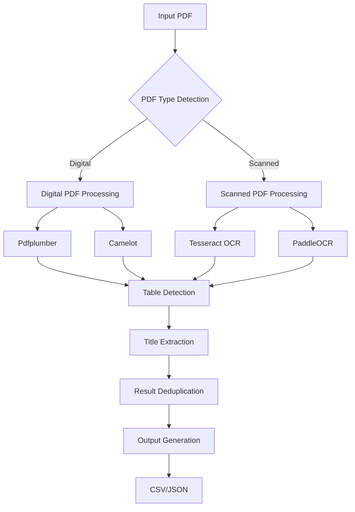

# PDF Table Detection and Extraction

A Python-based solution for detecting tables in financial statement PDFs, extracting their titles, and outputting the results in structured formats (CSV/JSON).

## High-Level Design



## Implementation Details

### Tools and Libraries Used

1. **PDF Processing**
   - **PyMuPDF (fitz)**: Used for initial PDF type detection and text extraction
   - **Pdfplumber**: Primary tool for digital PDF table detection and layout analysis
   - **Camelot**: Secondary tool for digital PDF table extraction with high accuracy

2. **OCR Tools**
   - **Tesseract**: Primary OCR engine for scanned PDFs
   - **PaddleOCR**: Secondary OCR engine with multi-language support

3. **Core Dependencies**
   - Python 3.8+
   - OpenCV for image processing
   - NumPy for numerical operations
   - Pandas for data handling

### Tool Selection Rationale

1. **PyMuPDF**
   - Fast and efficient PDF parsing
   - Excellent text extraction capabilities
   - Used for initial PDF type detection

2. **Pdfplumber**
   - Superior layout analysis
   - Accurate table boundary detection
   - Good text extraction with position information

3. **Camelot**
   - High accuracy in table structure detection
   - Handles complex table layouts
   - Good for financial statements

4. **Tesseract & PaddleOCR**
   - Tesseract: Industry standard OCR engine
   - PaddleOCR: Better accuracy for financial documents
   - Combined for maximum coverage

## Project Structure

```
detect-tables-pdf/
├── input/                  # Input PDF files
├── output/                 # Generated output files
├── table_extractors/       # Table extraction modules
│   ├── pymupdf_utils.py    # PDF type detection
│   ├── pdfplumber_utils.py # Digital PDF processing
│   ├── camelot_utils.py    # Digital PDF processing
│   ├── tesseract_utils.py  # Scanned PDF processing
│   └── paddleocr_utils.py  # Scanned PDF processing
├── main.py                 # Main script
├── requirements.txt        # Project dependencies
└── README.md              # Project documentation
```

## Setup and Installation

1. **Prerequisites**
   - Python 3.8 or higher
   - Tesseract OCR installed on your system
   - Ghostscript installed on your system

2. **Installation**
   ```bash
   # Clone the repository
   git clone https://github.com/yourusername/detect-tables-pdf.git
   cd detect-tables-pdf

   # Create and activate virtual environment
   python -m venv .venv
   source .venv/bin/activate  # On Windows: .venv\Scripts\activate

   # Install dependencies
   pip install -r requirements.txt
   ```

3. **Environment Setup**
   - Create a `.env` file in the project root
   - Add any required API keys or configurations

## Usage

1. **Process a Single PDF**
   ```bash
   python main.py --input input/Document1.pdf --output output --format csv
   ```

2. **Process Multiple PDFs**
   ```bash
   python main.py --input input --output output --format csv
   ```

3. **Output Formats**
   - CSV: Simple table title and page number format
   - JSON: Detailed output with additional metadata

## Output Format

1. **CSV Output**
   ```csv
   Table Title,Page Number
   "Balance Sheet",1
   "Income Statement",2
   ```

2. **JSON Output**
   ```json
   [
     {
       "title": "Balance Sheet",
       "page": 1,
       "confidence": 0.95,
       "tool": "Pdfplumber"
     }
   ]
   ```

## Edge Cases Handling

1. **Multi-page Tables**
   - Tables spanning multiple pages are detected and linked
   - Page numbers are recorded for each table section

2. **Missing Titles**
   - Uses proximity analysis to find potential titles
   - Falls back to "Untitled Table" if no title is found

3. **Scanned PDFs**
   - Automatic detection of scanned PDFs
   - Uses OCR tools for text extraction
   - Combines results from multiple OCR engines

## Security

- No hardcoded credentials
- Environment variables for sensitive data
- `.gitignore` configured to exclude sensitive files

## License

This project is licensed under the Apache 2.0 License - see the LICENSE file for details.

## Contributing

1. Fork the repository
2. Create your feature branch
3. Commit your changes
4. Push to the branch
5. Create a Pull Request 